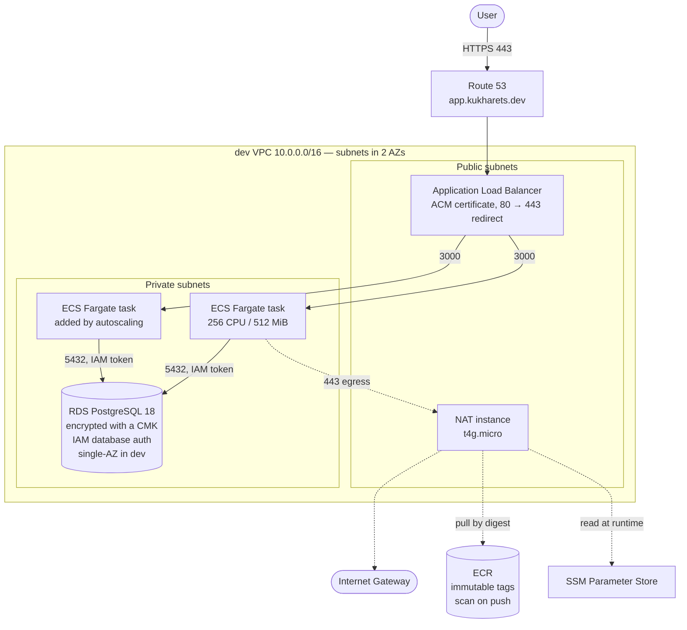

# task-tracker-aws

A small Next.js + PostgreSQL task tracker, deployed to AWS entirely from Terraform and
GitHub Actions. Live at **https://app.kukharets.dev**.

The application itself is deliberately ordinary. The point of the repository is everything
around it: how the infrastructure is described, how a commit reaches production, and which
security controls are wired in rather than bolted on.

---

## Architecture



### What "two availability zones" does and does not mean here

The network is laid out across `us-east-1a` and `us-east-1b` — four subnets, two per zone. The
load balancer spans both, and the ECS service is free to place tasks in either.

The **workload** is not highly available in dev, and that is a cost decision rather than an
oversight. `desired_count` is 1, so a single task runs in whichever zone the scheduler picked.
RDS runs `multi_az = false`, so the database is a single instance with no standby. The
production root module flips the same variable to `true`.

So: losing a zone means an outage in dev, and the layout is what makes the fix a variable change
rather than a rebuild.

Nothing in the private subnets has a public address, and there are no VPC interface endpoints —
so every outbound call, including the image pull from ECR and the parameter read from SSM, leaves
through a NAT instance rather than a NAT gateway — at this traffic volume
the gateway's fixed hourly charge dominates the bill, while a `t4g.micro` with
`source_dest_check` disabled carries the same egress for a fraction of it. The trade is real:
the instance is a single point of failure and has to be patched, which a managed gateway would
not be.

---

## Design decisions

The parts worth arguing about, and what each one trades away.

### No long-lived AWS credentials in the pipeline

GitHub Actions authenticates through OIDC. There is no access key in the repository secrets,
so there is nothing to rotate and nothing to leak.

The trust policy pins the **immutable** form of the subject claim — numeric account and
repository IDs rather than names:

```
repo:Light3313@202292607/task-tracker-aws@1301640311:ref:refs/heads/main
```

Names can be transferred; a renamed account could otherwise inherit the trust. The numeric
IDs cannot be reassigned.

### Separate roles for planning, applying and promoting

| Role | Assumed by | Can do |
|---|---|---|
| `tt-terraform-planner` | pull requests | read state, `terraform plan` |
| `tt-terraform-deployer` | pushes to `main` | `terraform apply` |
| `tt-terraform-deployer-prod` | the promotion workflow, gated on an environment | apply to the production stack |

A pull request must not be able to change infrastructure — a fork or a rogue branch would
otherwise get an apply. Splitting the roles also exposes an asymmetry worth knowing about:
**a green plan on a pull request proves nothing about the deployer's permissions**, because
the two identities are different. Both were widened together and verified with
`iam simulate-principal-policy`.

### The database has no password

The application connects with **IAM database authentication**. A short-lived token is minted
locally from the task role's credentials for each new physical connection — no secret is
stored, injected, or rotated. TLS is mandatory for IAM auth, so the transport is encrypted
by construction.

Locally the same code path falls back to a plain `DATABASE_URL`, which keeps
`docker compose up` a one-command experience.

The RDS master password is never seen by a human either: `manage_master_user_password`
hands it to Secrets Manager.

### Deploy by digest, never by tag

The ECR repository is set to `IMMUTABLE` tags with scan-on-push. The pipeline pushes an image,
resolves its `sha256` digest, and passes **that** to Terraform.

A tag is a moving pointer; a digest is the image. Deploying by tag means the artifact that was
tested and the artifact that runs are only conventionally the same thing.

### Promotion moves the artifact, not the source

`promote-prod.yml` does not build anything. It reads the digest that is **currently running in
dev**, and deploys that exact image to production behind a GitHub Environment with a manual
approval gate.

Reading from the live service rather than from dev's Terraform state is deliberate: state
records intent, the service records fact, and the two diverge precisely when an apply
half-failed.

Promotion is a separate workflow rather than a gated job inside the deploy pipeline. A manual
approval in the path of every push creates a queue — and a newer queued run cancels the
pending one, so a slow approval would silently drop a dev deployment.

### Secrets are fetched, not injected

The task definition has no `secrets:` block. The application reads what it needs from SSM
Parameter Store at runtime.

Injected values land in the container's environment, which is readable by anything inside the
container and appears in `describe-task-definition` output. Fetching keeps the value out of both.

Being honest about the limit: the fetched secret is cached for the lifetime of the process, so
rotating it in SSM still requires the tasks to be replaced. Runtime fetching buys confidentiality
here, not rotation — picking up a rotated value without a redeployment would need a TTL on that
cache, and there is none.

The cost is one AWS API call on the first request that needs the secret, and an IAM policy on the
task role.

### Directory per environment, not workspaces

`infra/environments/dev` and `infra/environments/prod` are separate root modules over a shared
`modules/app_stack`. Workspaces share one backend configuration, so the blast radius of a
mistyped command is every environment at once. Separate directories mean separate state objects
and a `cd` that has to be deliberate.

The state bucket itself is shared; the separation that carries weight is in IAM — the production
role's access is scoped to the `task-tracker/prod/*` key prefix, so the dev identity cannot reach
production state at all.

---

## Security controls

| Layer | Control |
|---|---|
| Identity | OIDC federation, no static keys; separate plan and apply roles; immutable subject claim |
| Network | No public IPs on workloads; tier-to-tier rules reference security groups by ID rather than by CIDR, so they survive an address change; only the internet-facing ingress and the egress rules use CIDRs; VPC flow logs to CloudWatch |
| Data | RDS encrypted with a customer-managed KMS key; not publicly accessible; IAM auth with mandatory TLS; master password in Secrets Manager; 7-day backups |
| Container | Multi-stage build; `npm` removed from the runtime image; runs as a non-root user; `readonlyRootFilesystem`; `/tmp` is a `tmpfs` mounted `noexec,nosuid,nodev` |
| Supply chain | Immutable ECR tags with scan-on-push; deployment by digest; GitHub Actions pinned to commit SHAs; Dependabot version updates for Actions |
| Pipeline | Trivy scans the built image and the Terraform configuration, both uploaded as SARIF; `terraform plan` on pull requests targeting `main` |
| Branch | Ruleset on `main`: pull request required, no force-push, no deletion, required status checks (lint, image scan, config scan, `terraform plan`, CodeQL) |

---

## Pipelines

| Workflow | Trigger | What it does |
|---|---|---|
| `ci.yml` | pull request | lint · build and Trivy-scan the image · Trivy config scan · `terraform plan` as the planner role |
| `deploy.yml` | push to `main` | build, push to ECR, resolve the digest, `terraform apply` to dev |
| `promote-prod.yml` | manual dispatch | read the running dev digest, apply it to production behind an approval gate |

Both scans upload SARIF to GitHub code scanning. Findings on a pull request are filed against
the pull request's branch, not `main`.

---

## Layout

```
src/                        Next.js application (App Router)
  app/api/                  auth, tasks, healthz, readyz, metrics
  lib/                      config, database pool, session handling
db/schema.sql               schema
scripts/migrate.mjs         migration runner
Dockerfile                  multi-stage build, non-root runtime
docker-compose.yml          nginx + application + Postgres on three networks
infra/
  modules/app_stack/        network, security groups, RDS, ALB, ECS — one reusable module
  environments/dev/         dev root module
  environments/prod/        production root module
  global/                   Route 53, ACM, ECR, OIDC provider, deployment roles, KMS keys
.github/workflows/          CI, deploy, production promotion
```

`infra/global` holds everything that outlives an environment and must exist before one can be
created — the DNS zone, certificates, the registry, and the identity the pipeline assumes.

---

## Running it locally

```bash
cp .env.example .env          # then set SESSION_SECRET
docker compose up --build
```

The stack comes up on **`http://localhost:8088`**. Only nginx publishes a port; the application
and Postgres sit on internal networks and are unreachable from the host, which mirrors the way
the cloud stack keeps its workloads off the public internet.

No AWS account or credentials are needed — `DATABASE_URL` is present locally, so the code takes
the password path instead of the IAM path.

To bring up the cloud stack, an image reference is required and has no default:

```bash
terraform -chdir=infra/environments/dev apply \
  -var "app_image=<account>.dkr.ecr.us-east-1.amazonaws.com/task-tracker@sha256:..."
```

The variable is mandatory on `destroy` as well, since the task definition is part of the graph.

---

## Stack

Next.js 15 · TypeScript · PostgreSQL 18 · Terraform · AWS ECS Fargate, ALB, RDS, ECR, Route 53,
ACM, KMS, SSM, Secrets Manager · GitHub Actions · Trivy

## License

MIT
